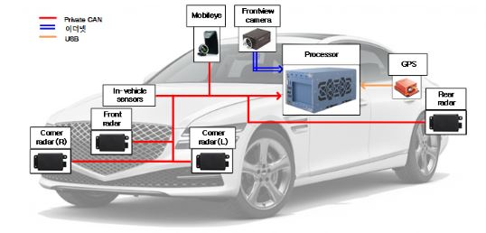
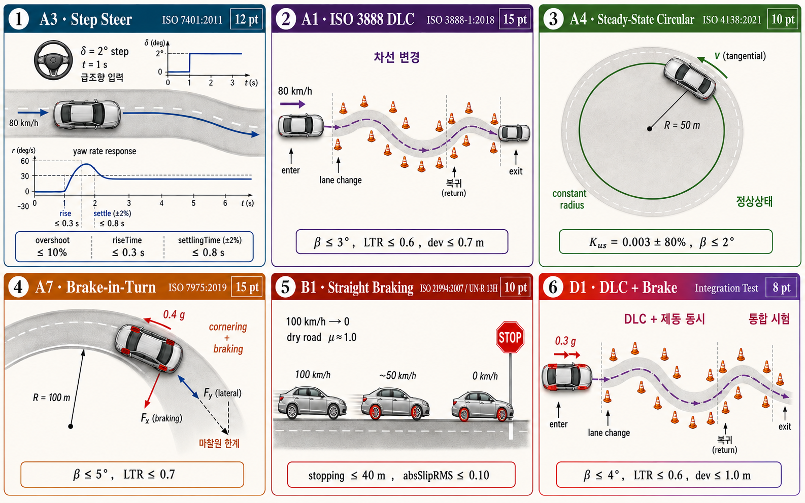

<div align="center">

# 🚗 Automatic Control · TA Workbooks

### 자동제어특론 조교 실습 자료 모음 · 2026 Spring

차량 동역학을 소재로 한 **인터랙티브 제어 실습 워크북** 3종 —
MathJax 수식, 실시간 시뮬레이션, 단계별 풀이가 한 페이지에 담겨 있습니다.

<br>



<sub>예제 차량 플랫폼 — Genesis G80 센서 아키텍처 (CAN · Ethernet · USB)</sub>

<br>

[](https://www.mathjax.org/)
[]()
[]()
[]()

</div>

---

## 📖 소개

이 저장소는 자동제어특론 강의의 조교(TA) 실습 자료를 모은 곳입니다.
모든 자료는 **단일 HTML 파일**로 작성되어 브라우저만 있으면 바로 열리며,
수식은 MathJax로 렌더링되고 일부 페이지는 **브라우저 안에서 직접 돌아가는 시뮬레이션**을 포함합니다.

> 별도 설치 없이 — 파일을 열거나 GitHub Pages 링크로 접속하면 끝.

---

## 📚 워크북

| | 워크북 | 내용 | 바로가기 |
|:--:|:--|:--|:--:|
| 🛞 | **Cruise Control for a Real Vehicle**<br><sub>30-min Workbook · G80 FOT</sub> | Plant 식별 → 개루프 분석 → PID 설계 → 실시간 추종 주행. Pole map · root locus 시각화 포함 | [열기](https://sangyeonso.github.io/Automatic_control_TA/CruiseControl_practice.html) |
| 📐 | **Automatic Control · HW 03**<br><sub>Solution Workbook</sub> | Mass–spring–damper 튜닝, 위성 자세제어 system type & error constant, 보상기 설계, 피드백 구조 비교 | [열기](https://sangyeonso.github.io/Automatic_control_TA/hw03.html) |
| 🏁 | **ICC Final Project**<br><sub>Tutorial Workbook</sub> | BMW_5 14DOF 가상 차량을 6개 표준 시나리오에서 제어, baseline 대비 KPI 개선율 자동 채점 | [열기](https://sangyeonso.github.io/Automatic_control_TA/icc_final_project.html) |

> 🌐 라이브 사이트: **https://sangyeonso.github.io/Automatic_control_TA/**
> <sub>(GitHub → Settings → Pages → Source: `main` 브랜치 `/docs` 폴더로 설정되어 있어야 합니다.)</sub>

---

## 🏁 ICC Final Project 미리보기

> **BMW_5 가상 차량을 6개 표준 시나리오에서 제어해, baseline KPI를 임계 아래로 떨어뜨린다.**
> 학생은 `ctrl_*.m` 함수 4개를 채우고, baseline 대비 KPI 개선율로 자동 채점됩니다.

**6종 표준 시나리오 (ISO 기준)**



<div align="center">

| KPI | Baseline (제어 OFF) | Target (만점 조건) |
|:--|:--:|:--:|
| `sideSlipMax` | 30.5° | ≤ 5° |
| `stoppingDistance` | 72.3 m | ≤ 40 m |
| `absSlipRMS` | 0.73 | ≤ 0.10 |

</div>

---

## 🗂️ 구성

```
Automatic_control_TA/
├── README.md
├── G80.JPG                          # 차량 센서 아키텍처 다이어그램
└── docs/                            # GitHub Pages 루트
    ├── CruiseControl_practice.html  # 크루즈 컨트롤 실습
    ├── hw03.html                    # HW03 풀이 워크북
    ├── icc_final_project.html       # ICC 기말 프로젝트
    └── images/
        ├── scenarios_6.png          # 6종 시나리오
        └── vehicle_14dof.webp       # 14DOF 차량 모델
```

---

<div align="center">
<sub>Automatic Control · Teaching Assistant Material · 2026 Spring</sub>
</div>
